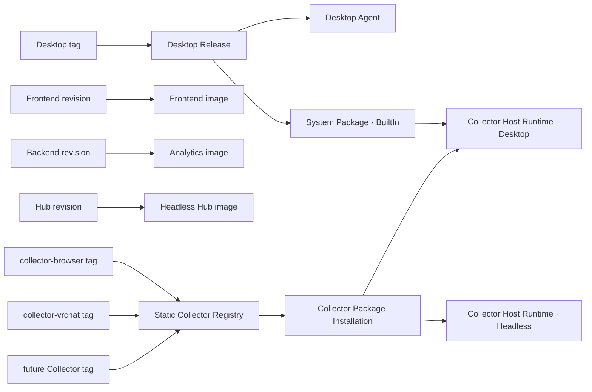
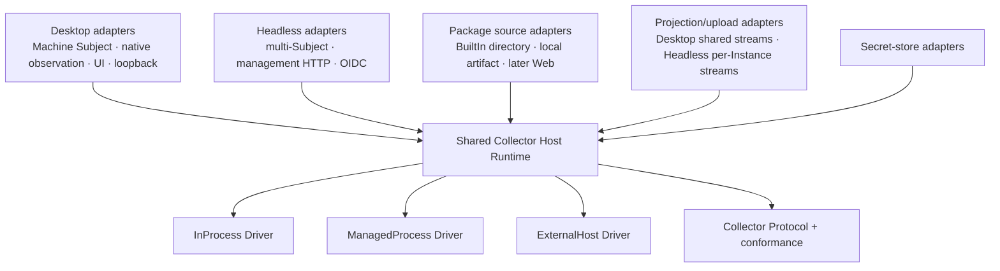
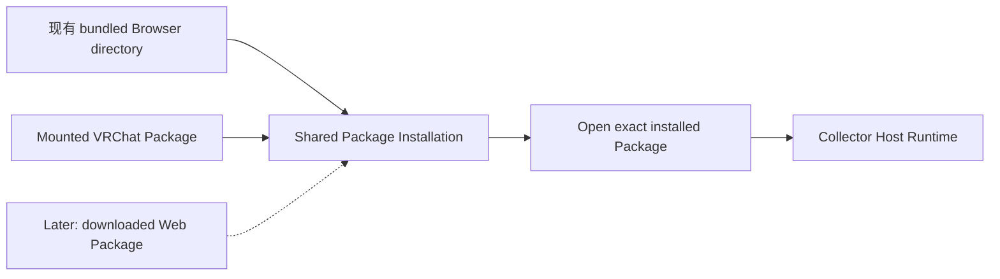
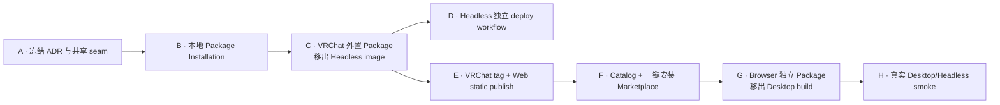
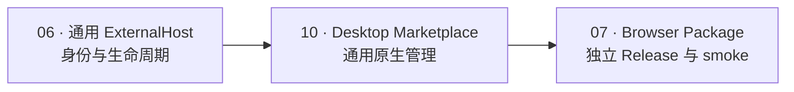
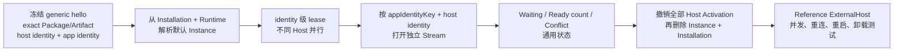
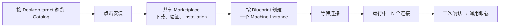

# Collector Host Runtime 与独立交付目标架构

本文记录 [ADR-048](../adr/048-shared-collector-host-runtime-and-independent-release-units.md) 的目标拓扑和
实现顺序。它取代已经撤回的 Registry 候选批准/LKG 切换路线；可靠性地基仍由 ADR-040/046 与现有
Collector Protocol conformance tests 承担。宿主组合边界以
[ADR-049](../adr/049-named-optional-collectors-outside-host-composition.md) 为准：具名可选 Collector 不进入
Host composition，宿主只组合通用 seam 加上 System BuiltIn。
通用 ExternalHost 的身份与并发模型以
[ADR-051](../adr/051-generic-external-host-identity-and-browser-delivery.md) 为准：一个 Browser Instance 承载
多个 External Host，Collector 直接提供 `appIdentityKey`，Host 不解析 App Hint。

## 目标

- Desktop 独立构建、发布和下载；System Collector 随 Desktop Release。
- Frontend、Analytics Backend、Headless Hub 各自构建和部署。
- Browser、VRChat 与未来非 BuiltIn Collector 各自显式构建为 Collector Package，并经静态 Web 路径
  独立发布。
- Desktop 与 Headless 复用同一个宿主无关 Collector Host Runtime；宿主差异只存在于 adapter。
- 当前只做显式精确 Installation 与启动，不建设自动更新控制面。
- 当前自用版本不建设 Package 人工加载说明、打开目录按钮或脚本执行器；Browser 扩展由操作者自行加载。

## 发布拓扑

发布单元之间不互相重建：Collector 发布不触发 Host 发布，Headless 发布不触发 Backend，Frontend image
不携带 Registry 文件。相同域名只由反向代理组合访问路径。

## 共享 Runtime 的 seam

现有 `CollectorRuntime` 已由 Desktop 与 Headless 复用；待收敛的是其外层 Host 编排。目标 module 的
interface 只暴露“安装/打开精确 Package、配置 Instance、启动/停止 Activation、读取 Runtime State”，
并隐藏 Package 目录、Execution Driver 与协议生命周期细节。

### Runtime 共同拥有

- Collector Installation、Instance、Activation 与 Runtime State；
- Package loader 与 Artifact Descriptor 选择；
- InProcess、ManagedProcess、ExternalHost Driver；
- Protocol handshake、Ready、Fact/Gap、ACK、drain 与生命周期所有权。

### 宿主 adapter 保留

- Desktop 的平台观察、输入 hook、图标、UI、Machine identity 和通用 ExternalHost loopback 监听；
- Headless 的多 Subject 配置、owner-only management HTTP 与 OIDC；
- Desktop 的共享 device 上传流与 Headless 的 per-Instance 上传流；
- 数据路径、部署配置和 Secret 持久化选择。

投影/上传只有在共同 interface 足够小且不需要 `if desktop/headless` 分支时才继续下沉。共享 Runtime 不是
把两个 composition root 合并，也不是要求两个宿主拥有相同 UI 或 Subject 拓扑。

## Collector 矩阵

| Collector | Package 发布 | Delivery | Driver | 默认宿主 | Runtime 实际拥有的动作 |
|---|---|---|---|---|---|
| System | Desktop tag | BuiltIn | InProcess | Desktop | 构造、启动、停止 |
| Browser | 独立 Collector tag | Web | ExternalHost | Desktop | 安装 Package、接受/拒绝连接、撤销 lease；不启动浏览器 |
| VRChat | 独立 Collector tag | Web | ManagedProcess | Headless | 安装 Package、启动/终止子进程 |
| 后续 Collector | 独立 tag 或 BuiltIn | 按 Package 决定 | 按 Artifact Descriptor | Desktop/Headless | 只执行所选 Driver 真正拥有的动作 |

统一 Protocol 是语义统一，不是 transport 统一。三类 Driver 必须继续通过相同 conformance vectors。

上表是目标态。Browser 一行的"默认宿主 = Desktop"现在只差 Browser 自己那一半：ADR-049 之后宿主不再持有
Browser runtime、专属 protocol handler、安装目录或 UI 条目，而通用 ExternalHost 接入能力已按 ADR-051 实现
（issue 06），Desktop 两个 head 都注册了通用 binding，通用 Marketplace 安装入口也已完成（issue 10）。
Browser 要真正接上，只剩它自己的 Package 发布与真实 smoke（issue 07）。

## 第一条小功能：外置本地 VRChat Package

第一条 tracer 不接 Web、不做更新状态机，而是让真实 Package 生命周期先脱离 Host image：

1. 提取共享 `Collector Package Installation` module，接收一个本地精确 Package，完成现有
   manifest/artifact/hash 校验并记录 Installation。
2. Desktop Browser 当前 bundled import 改用该 module，保持用户行为不变。
3. Headless 从挂载目录安装并启动 VRChat Package；Headless image 不再构建或携带 VRChat。
4. Headless 与 VRChat 分别构建后，证明“只替换 VRChat Package + 重启 Headless”无需重建 Hub image。

这条功能有两个真实调用者，形成真实 seam；后续 Web delivery 只新增 Package source adapter：

2026-09-02 更新：这条 tracer 的两个调用者只剩一个。Desktop 的 Browser bundled import 已随宿主解耦删除
（ADR-049），`CollectorPackageInstallations` 当时只有 Headless 的 VRChat 启动在用。

2026-09-04 更新：Desktop 侧的调用者回来了，但换成了通用形态——`AddExternalHostCollectorBinding` 在两个
Desktop head 上注册 `CollectorPackageInstallations`，通用 ExternalHost handler 用它把对端声明的精确
Package/Artifact 解析成已验证 Installation（issue 06）。它不是 Browser 专属 import 的复活。

### 明确不进入第一条 tracer

- channel、SemVer solver、后台检查或通知；
- owner approval、offer、候选稳定窗口、LKG 自动切换；
- Ed25519、密钥轮换、撤回、第三方市场；
- 安装 journal、断电恢复、cache GC；
- Browser 独立 Web 发布和 UI 安装入口。

## 已完成的地基顺序

- B/C 已落地并被 F 取代来源适配：共享 Installation module 建立，VRChat Package 与 Headless image
  分开构建；Headless 不再读手工挂载来源，只从 Registry 获取新安装。
- D 已落地：`deploy-hub.yml` 只测试、构建、推送和重启 Hub，不触发 Backend/Frontend/Collector。
- E 已完成：专属 tag workflow 生成确定性 zip 与不可变 `release.json`，向同域静态目录追加精确 Version；
  VRChat 0.2.1 已真实发布、进入 Catalog 并完成生产 Marketplace smoke。F 已按 ADR-050 增加 Registry Catalog 与一键安装 Marketplace；
  普通 `main` 验证不发布用户可见 Package。
- G 已完成宿主侧的全部：Desktop 构建与产物不含 Browser，宿主也不再认识 Browser——Hub 与两个平台 head
  没有它的 runtime、专属 protocol handler、安装目录、平台知识或 UI 条目（ADR-049）。通用 ExternalHost 的连接
  能力也已实现（issue 06：一条 `/v1/collector-protocol/external-host` route，身份级所有权）。剩下的是 Collector
  tag 与可下载 Package（依赖 E/F）以及 Desktop 的安装入口（issue 10）；在这两者到位前 Browser 仍然没有实际
  接入路径。
- G 的剩余部分复用已经证明的 Installation/Web seam，不恢复 Browser 专属 binding。

## 下一阶段实现顺序

顺序不能颠倒：Browser 不能先用专属 handler 抢跑；Desktop UI 也不能自行复制一套 Package 下载或 Runtime
状态。每一步都先用 Reference Collector 证明通用 interface，再由 Browser 成为真实调用者。

### Feature 06：通用 ExternalHost Runtime（已完成）

这一步同时删除 `ICollectorAppHintResolver`：ExternalHost Collector 直接提供稳定 `appIdentityKey`，通用
Segment 投影只消费该 dimension。现有 Instance 级 writer 冲突必须被 identity/Stream 级所有权取代，而不是
在外面增加重试。

2026-09-04：已按上图实现。`ExternalHostCollectorProtocolHandler` 承载
`/v1/collector-protocol/external-host`，Instance 由 Runtime 拥有（一个 Package 一台机器一个默认 Instance），
所有权单位是 (Instance, External Host Identity) 与它打开的 Stream，`ICollectorAppHintResolver` 已删除。
实现中修掉三个「引用来源从宿主状态变成对端声明」才成立的缺陷（畸形引用以未处理异常收场、围栏后
`facts.publish` 裸抛 `OperationCanceledException`、被拒绝的 hello 会留下持久 Instance），细节见
`.scratch/collector-package-registry/issues/06-browser-external-host-update.md`。

### Feature 10：Desktop 通用 Marketplace

Windows/macOS 共享同一 presentation 行为；platform head 只提供 target、Machine Subject 与本机 adapter。
System 不进入 Marketplace，Package 不提供人工加载说明，主 UI 不显示随机 External Host Identity。

2026-09-04 已完成宿主侧实现：`CollectorMarketplaceRuntime` 是 Desktop 与 Headless 共用的深模块，统一拥有
Installation、默认 Instance、Driver、Activation、恢复、状态、重试与卸载；两个宿主不再各自编排这些阶段。
macOS publish/Portable 实包已验证只含 System，最终包启动 smoke 留给 CI（issue 10 `ready-for-human`）。

### Feature 07：Browser 独立 Package 与真实纵切

```mermaid
flowchart LR
    Collector["Browser 自己识别 Chrome/Edge<br/>生成 appIdentityKey"] --> Protocol["generic ExternalHost hello<br/>持久 host identity"]
    Protocol --> Package["Machine Blueprint<br/>identity dimensions"]
    Package --> Tag["collector-browser/vX.Y.Z"]
    Tag --> Build["只构建一份确定性 Package"]
    Build --> Targets["登记 win/macOS<br/>x64/arm64 四个 target"]
    Targets --> Install["Desktop Marketplace 安装"]
    Install --> Manual["操作者手工 Load unpacked"]
    Manual --> Smoke["多 Host、重连、事实上传、卸载 smoke"]
```

首版只承诺 Chrome 与 Edge。Browser tag 不构建或发布 Desktop；Desktop tag 也不构建或携带 Browser。
本阶段没有 Package 更新或自动 extension reload，新版本需要先卸载再安装。

## 当前差距

- Desktop Release 已独立，且不再构建或携带 Browser Package：两个 Desktop head 与其测试项目都不再 import
  Browser 的 package target，Desktop Release 也不再安装 node、构建 Browser 或跑 Collector contracts
  （Browser 的构建与契约验证留在 `collector-contracts.yml`）。System 作为 BuiltIn 由 publish target 进入
  `dotnet publish` 产物，Desktop Release 另有产物断言（System 在、Browser 不在）与打包后的 startup smoke。
- Browser 目前是“代码已与 Desktop 解耦、宿主侧通用接入已就位、但它自己还没有 Web Release”：扩展代码、
  Package 构建 target 与 npm 测试留在 `collection/collectors/Heartbeat.Collector.Browser`，并继续由
  `collector-contracts.yml` 验证。Browser 专属 runtime 与 protocol handler 仍然不存在，
  `/v1/collector-protocol/browser` 也不会回来；宿主提供的是通用
  `/v1/collector-protocol/external-host`（issue 06），谁被安装谁能连，宿主不为 Browser 加分支。因此 Browser
  重新接上只差 Package 发布（issue 07）；Desktop 通用安装入口已经完成（issue 10）。
- `facts.segment/v1` 已统一走 ActivitySegment 投影：Package 自有 JSON Schema 先验证 payload，通用 projector
  再要求共同 `identityKey`，Hub 不再按 schema id / major 列出 Browser、VRChat 或测试 Collector。Hub.Tests
  也不再构建 Browser 或引用 VRChat 产品；VRChat ManagedProcess E2E 由 Collector 自身测试拥有。
- Desktop 与 Headless 现在直接调用同一个 `CollectorMarketplaceRuntime`；Catalog、Installation、默认 Instance、
  Driver dispatch、Activation、恢复、状态、重试与卸载只有一份实现。Desktop 只提供 Machine Subject，Headless
  只提供 per-Instance analytics pipeline adapter。
- Headless bootstrap 只含基础设施配置；手写 `instances`、`packageDirectory` 与
  `headless-instance-map.json` 已直接移除。Runtime state 是 Instance 唯一权威，重启按精确 Installation
  离线恢复；管理面只透出 Runtime 的真实阶段、授权挑战与失败。
- Frontend 与 Backend workflow 已独立；Backend workflow 不再构建、推送或重启 Headless。
- Analytics 启动只预插 System BuiltIn 的 Observation Depth 声明；非 BuiltIn Collector 通过运行时上报，
  已有数据库声明继续由通用生效路径读取。
- Headless image 不构建或携带可选 Package，也不挂载具名 Package 来源。共享 Marketplace 从 Catalog 获取
  精确 release，统一校验 metadata/length/hash/zip/Package 后交给 `CollectorPackageInstallations`；公开 interface
  不含任何具名 Collector，可由未来 Desktop 直接复用。
- 静态 Registry 的精确 Version、按 Host target 独立的 Catalog Latest 与 Collector tag 更新链已落地；Latest
  只用于首次发现，Runtime 保存的精确 Package identity 才是重启权威。VRChat 0.2.1 Catalog 与生产端到端
  smoke 已完成，下一条真实发布纵切是 Browser。

## 验收边界

目标完成需要同时证明：

- 四个 Host/application release unit 可独立构建和部署；
- 宿主组合只含通用 seam 与 System BuiltIn，任何具名可选 Collector 的增删都不改宿主代码、UI 或 smoke；
- System 只随 Desktop Release；
- Browser/VRChat 各自 tag 能产生独立 Package；
- 同一个共享 Installation module 被 Desktop 与 Headless 使用；
- VRChat Package 发布/安装不重建 Headless，Browser Package 发布/安装不重建 Desktop；
- 三类 Driver 继续通过统一 Protocol conformance；
- 真实 Desktop Browser 与 Headless VRChat smoke 成功。
