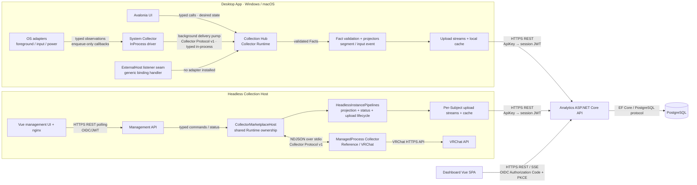
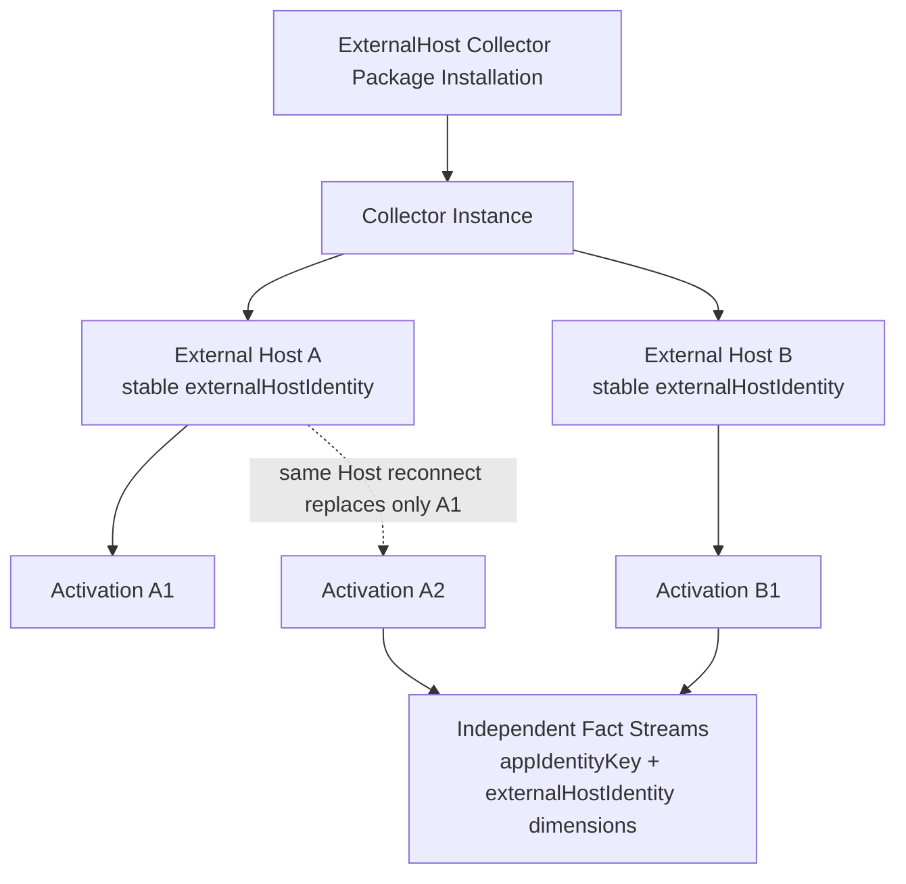
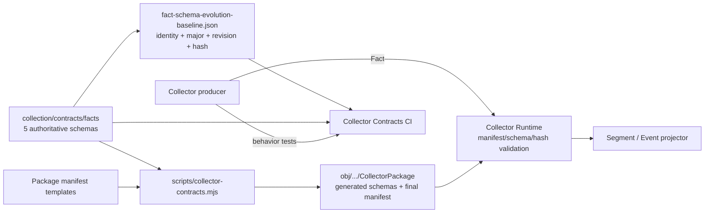

# Heartbeat 系统架构与协议

本文描述当前实现，而不是远期愿景。Collector 的身份与协议术语以 [Collection Context](../../collection/CONTEXT.md) 和 [ADR-040](../adr/040-collector-runtime-and-protocol-foundation.md) 为准。

## 运行时模块与交互

通用 ExternalHost listener 由 `AddExternalHostCollectorBinding` 注册的
`ExternalHostCollectorProtocolHandler` 承载，route 是 `/v1/collector-protocol/external-host`；两个 Desktop head
都已接入，没有接入这个 binding 的宿主（如 Headless）保留 `NullExternalHostProtocolHttpHandler` 一律 404。
Browser 专属 discovery 路由仍然不存在，也不会再有：这条 route 不认识任何具名 Collector。旧的
`POST /v1/segments`、`GET /v1/hub` 和 source 级配置/声明入口已经退役。`SegmentIngestService` 仍是 Runtime projector 的内部 segment sink，不是外部协议。

Desktop 的平台观察回调不执行协议 I/O：system Collector 先把 Segment / Event 放入 ingress queue，再由后台 delivery pump 持久化并发送。Collector Protocol Client 不捕获宿主 `SynchronizationContext`，因此 Hub 背压不会阻塞 Avalonia UI、macOS LaunchServices 回调或 Windows hook/message-loop 线程。

## ExternalHost 身份语义

并发所有权的单位是 (Collector Instance, External Host Identity) 与它打开的 Fact Stream，不是整个 Instance：
同一个 Instance 下不同 identity 可以同时 Ready 并各自写自己的 Stream，同一 identity 重连只以 `LeaseReplaced`
替换自己的旧 Activation。Instance 由 Runtime 拥有，一个 Package 在一台机器上只有一个默认 Instance
（`InstanceKey = "default"`），外部宿主不各自造 Instance。

`externalHostIdentity` 由外部宿主自己生成并持久化；清除其数据或重装会产生新 Host，旧 Host 只作为历史身份
保留。identity 到 `appIdentityKey` 的绑定权威是持久 Stream 的 identifying dimensions，因此宿主重启后同一
identity 仍然不能静默改绑到另一个 App Key。Collector 直接提供稳定 `appIdentityKey`；Backend 暂时不认识该 Key
时仍保留真实身份，Collector 无法可靠识别宿主 App 时不开始 Activation。

连接资格只由本地已验证 Installation 与 `hello` 声明的精确 Package/Artifact 身份决定：未安装得到
`package_not_installed`，version/contentHash/artifactId/artifactHash 任一漂移或声明的不是当前平台被选中的
`externalHost` Artifact 都 fail closed，被拒绝的连接不留下任何持久状态。安装存在但当前没有连接时，管理事实是
`WaitingForExternalHost`，不是 Activation 启动失败。

## Fact Schema 的单一来源与校验链

当前可执行协议只有 `segment` 与 `event`；`measurement` 保留在领域词汇中，但尚未进入 Collector Protocol v1。Package 用原始文件 hash 验证完整性；相同 `(schemaId, schemaMajor, schemaRevision)` 的 JSON 含义一旦进入基线就不可改变，纯排版变化不算演进。兼容演进增加 revision，破坏性演进增加 major。

## 跨实现 JSON 契约地图

| 文件或命名模式 | 谁读取 | 职责与权威边界 |
| --- | --- | --- |
| `collection/contracts/facts/*.schema.json` | staging、Runtime、producer/projector tests | Fact payload 与事实演进规则的唯一权威来源；文件名保留 Collector + 事实含义 |
| `fact-schema-evolution-baseline.json` | contract check / CI | 只锁定 schema identity 与规范化语义 hash，不是 Runtime 消息 |
| `collector-manifest.template.json` | Package staging | 源码中的静态 Package 清单；staging 补齐 schema hash、Artifact hash/size 后生成 `collector-manifest.json` |
| `observation-depth.declaration.json` | Package loader、Hub declaration uplink | 独立的观测深度/读数声明；不是 Fact Schema，也不从 schema 推导 |
| `*.artifact.json` | Package loader、Execution Driver | 描述一个可验证 Artifact。Browser 描述完整 sideload 文件集；InProcess fixture 描述其入口内容 |
| `collector-artifact-ref.json` | Browser 扩展、Browser Runtime | sideload payload 指回已验证 Artifact descriptor hash 的最小引用，不是 Package manifest |
| `collector-protocol-conformance.json` | .NET 与 TypeScript 协议测试 | 生命周期、ACK、重试、Gap 与 drain 的跨语言行为向量；不是 wire-message schema，也不是完整 transcript |

Collector Protocol 的消息字段与严格校验由共享协议/Runtime 代码承担，目前没有另一份 wire-message JSON Schema。`collector-runtime.json`、outbox、cache、secret store 与浏览器本地存储等 JSON 是单实现持久化状态，不属于跨实现协议，也不因本表统一命名。
